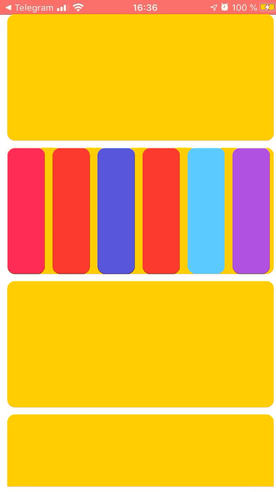

# ScrollableStackView
A Swift-written UIStackView that is able to scroll its contents if gets out of sight



## Usage

```
// init ScrollableStackView
let scrollableStack = ScrollableStackView();
// place ScrollableStackView right on self.view
// it will occupy all available space - like air in a jar
scrollableStack.placeVerticalStackOnView(view: myView)

// let's add some Arranged Views into scrollable StackView
for i in 1...10 {
    let customView : UIView = UIView();
    customView.frame = CGRect(x: 0, y: 0, width: 10, height: 170)
    customView.backgroundColor = .systemYellow
    
    if (i == 2) {
        let scrollableStackMini = ScrollableStackView();
        scrollableStackMini.placeHorizontalStackOnView(view: customView)
        // fill this one with automatic stubs
        scrollableStackMini.fillWithStubsHorizontal()
    }
    
    scrollableStack.addArrangedView(view: customView)
}
```
